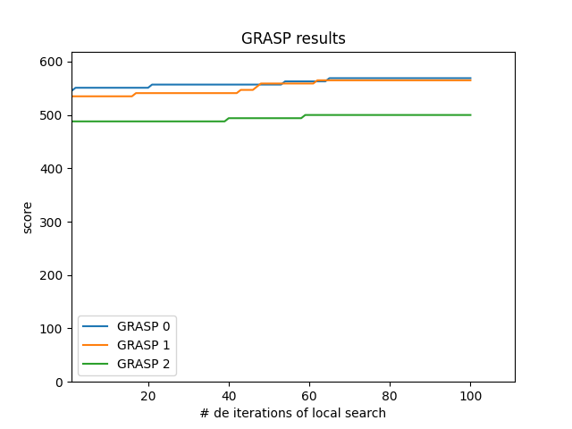

# Heuristica GRASP para MSA

### Materia algoritmos 

### [Trabajo Práctico: Final](./TP_final_Heurstica_GRASP_para_MSA.pdf)

### Pre-requisitos:
- Se necesita tener instalado los paquetes: numpy, matplotlib y biopython.

### Notas y configuración:
- En el folder ./src se encuentran los fuentes de la entrega.
- En el folder "./resources" se deben agregar los archivos con extension fasta y score-matrix para ser leidos correctamente.
- En el file "./src/main.py" se puede modificar el nombre del archivo deseado para leer el score-matrix en la variable "score_matrix_file", el fasta con la variable "fasta_file" y el score del gap con la variable "gap_penalty".
- En el file "./src/main.py" se puede modificar la variable "have_run_tests" con un booleano para decidir si correr o no los tests creados.
- En ./resources/NUC.4.2 se configura el score matrix que esta configurada por defecto.
- En ./resources/10.fasta se configura el fasta que esta configurada por defecto.
- Para ejecutar el algoritmo, ejecutar el main definido en "./src/main.py".
- En el folder "./output" se va a imprimir el output del main, los cuales son el gráfico (.png) y el alineamiento resultante (.txt).

### Ejemplo input:

- [Sequences to align](./resources/10.fasta)

- [Score Matrix](./resources/NUC.4.2)

### Ejemplo output:

- [GRASP output alignment file](./alignment-2021-12-09_09-10-22.txt)

- GRASP output chart:

